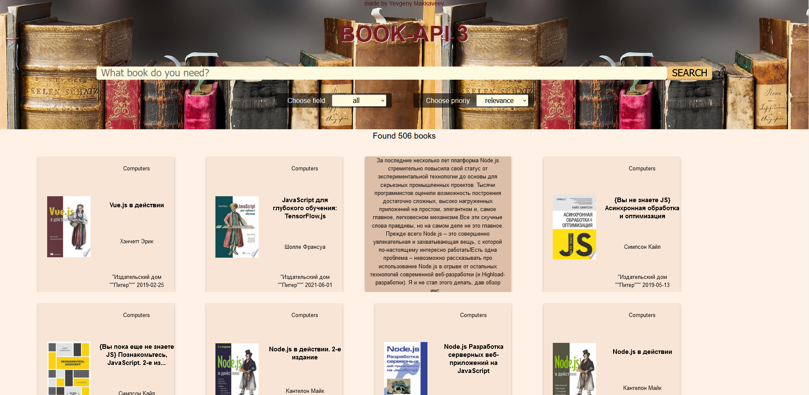
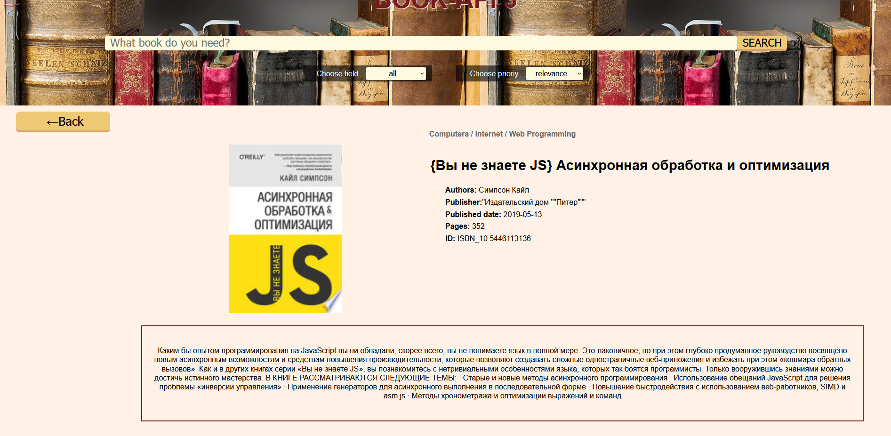

[Деплой](https://frosty-yalow-baa156.netlify.app/)

Сайт сделан при помощи TS React , Redux Toolkit, для стилизации использовались sass модули. Для получения данных с сервера использовался axios. Для многостраничности использовался React Router 6.
 Описание книги можно посмотреть, наведя на карточку мышкой.  Так же можно кликнуть для перехода на страницу, посвящённую книге.
 Для верстки использовались гриды и флексбоксы.
 Для тестов использовался Jest (Хотя большого опыта юнит тестов на данный момент я не имею)

